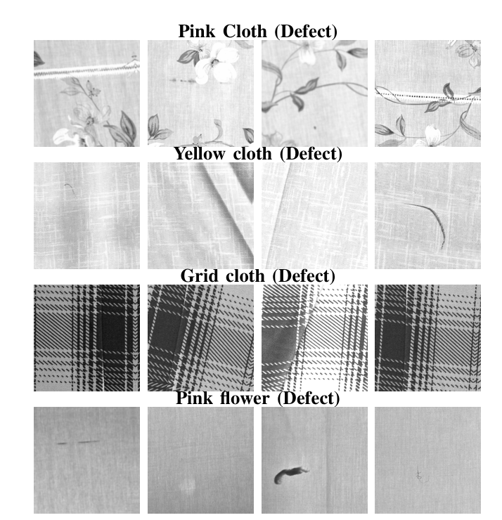
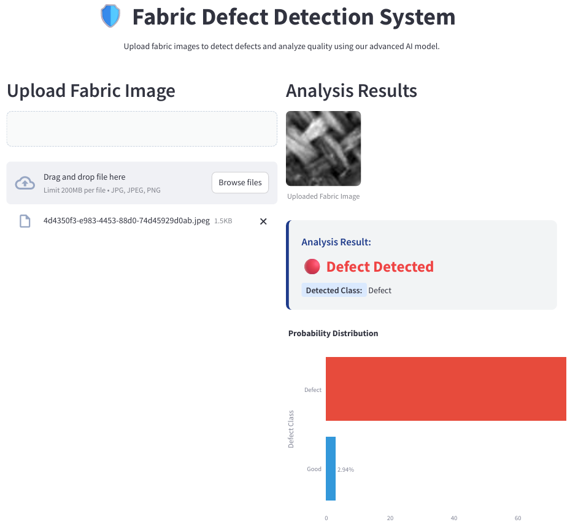

# Fabric-Defect-Detection
This project focuses on the automated identification of defects in fabric using deep learning models. It aims to eliminate manual inspection processes by applying convolutional neural networks (CNNs) to detect irregularities in fabric patterns.
Our work presents a complete, robust pipeline for identifying defects in woven fabrics, addressing common challenges like dataset imbalance, duplicate images, and noise. The project is applied to the Woven Fabric Defect Detection (WFDD) dataset.

## DATASETS USED FOR IMPLEMENTATION :

<ul>
<li>

**WFDD DATASET(Warping Fault Detection Dataset)**
It is organized into 4 distinct fabric types, each exhibiting a variety of flaw patterns.
I have used augmentation techniques for balancing the dataset and to increase generalisation
| Fabric Class   | Description                            | # Images | Defect Types                   |
| -------------- | -------------------------------------- | -------: | ------------------------------ |
| Grey Cloth     | Plain woven grey fabric                |      1K | • Block‑shape • Line‑type • Point‑like |
| Grid Cloth     | Woven pattern with grid/check motifs   |      1K | • Block‑shape • Line‑type • Point‑like |
| Yellow Cloth   | Solid yellow woven fabric              |      1K | • Block‑shape • Line‑type • Point‑like |
| Pink Flower    | Floral printed cloth from public set   |      1K | • Block‑shape • Line‑type • Point‑like |
</li>
</ul>

<ul>
<li>
 
**Total images**: 4000

</li>
</ul>

<ul>
<li>
 
 **Use cases**:  
 Binary classification (defect vs. non‑defect)  

</li>
</ul>

## Screenshots
## Augmented Image

* Sample augmented defect images generated for each fabric category.*

## Workflow
- **Duplicate Removal:** Uses SHA-256 hashing to identify and remove exact duplicate images.
- **Image Normalization:** Converts images to grayscale and normalizes intensity for stable processing.
- **Wavelet Denoising:*** Employs BayesShrink wavelet denoising to remove noise while preserving critical defect features.
- **Balanced Augmentation:** Strategically undersamples the majority class and augments the minority (defect) class to create a perfectly balanced dataset.
- **Hybrid Model Architecture:** A custom model featuring a frozen EfficientNetB0 backbone, multi-scale convolutional paths, Squeeze-and-Excitation (SE) attention, and transformer blocks.
- **Reproducibility:** All code, configurations, and model weights are provided to ensure full reproducibility of our results.

## Prerequisites
- Python 3.9+
- TensorFlow 2.8+
- OpenCV
- Scikit-image
- Albumentations
- Weights & Biases (for logging and sweeps)

### Folder Structure

WFDD/
├── grey_cloth/
│ ├── normal/
│ └── defect/
├── grid_cloth/
│ ├── normal/
│ └── defect/
├── yellow_cloth/
│ ├── normal/
│ └── defect/
└── pink_flower/
├── normal/
└── defect/
## Dashboard

